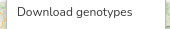
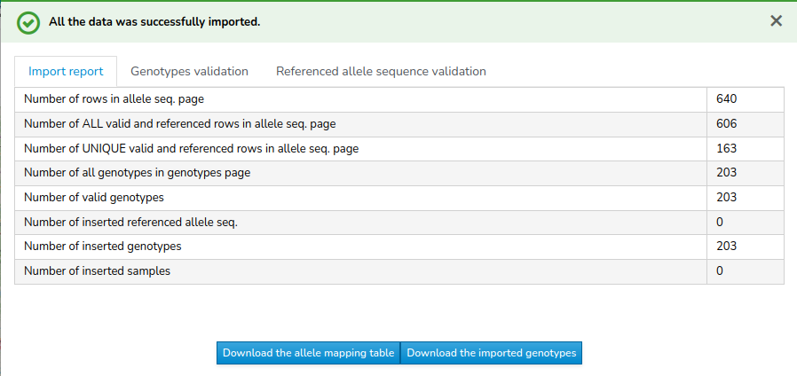
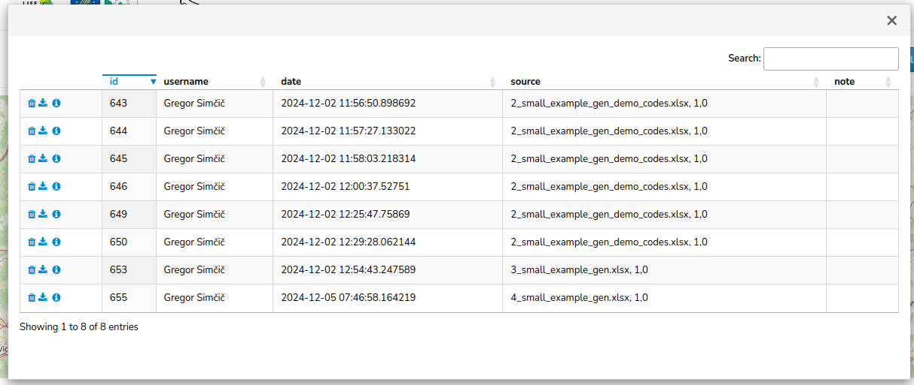

# Download Genotypes

Exporting genotypes is done through the main window of the genetic samples browser. The data is exported by navigating to **Export** -> **Download genotypes**  ->  from the general actions ribbon at the top of the browser.

After selecting **Download genotypes**, the database generates an `.xlsx` file that can be saved to your computer. The exported file contains genotypes for all the samples that (1) have a genotype data attached and (2) are displayed in the sample overview table at the bottom of the main window. If any [**Filters**](Filters) are active at the time of selecting **Download genotypes**, the `.xlsx` file will include only the filtered samples.

[Read more about data filtering options](Filters) 

The `.xlsx` file has 2 sheets:
  1. `allele_seq`: [Reference table of alleles](Terminology-and-Naming-Rules#Terminology) for selected genotypes
  2. `genotypes`: [Table of genotypes](Terminology-and-Naming-Rules#Terminology) for selected samples

## Allele Names  

Allele names used in the `.xlsx` file are the [names automatically generated by the database](Terminology-and-Naming-Rules#alleles). Renaming alleles to a user-defined naming schema can be performed after download if the user has the allele names mapping table.  

## Downloading the Allele Names Mapping Table  

The allele names mapping table can be downloaded after a successful import of genotype data by selecting the **Download allele mapping table** button:  
  

The table is also accessible at any time from the **List of genotypes imports** (**Batch imports** -> **List of genotypes imports**).  

After selecting this option, a table with all your genotype imports will be displayed:  
  

By clicking on the **info icon** , you can access the genotypes import report. From there, selecting **Download allele mapping table** will allow you to download the allele mapping table.  
