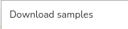

Exporting sample metadata is done through the main window of the genetic samples browser. The data is exported by navigating to **Export** -> **Download samples**  ->  from the general actions ribbon at the top of the browser.

After selecting **Download samples**, the database generates an `.xlsx` file that can be saved to your computer. The exported file contains information for all the samples displayed in the sample overview table at the bottom of the main window. If any [**Filters**](Filters) are active at the time of selecting **Download samples**, the `.xlsx` file will include only the filtered samples.

[Read more about data filtering options](Filters)