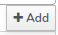

Filtering samples and genotypes is done trough the main window of genetic samples browser. Available filters are visible on the right side of the general actions ribbon on top of the browser..

Three filter buttons are avalible for users:
  1. All filters
  2. Shared
  3. Individuals

## All filters

The **All filters** button  allow the user to filter the samples based on any available [sample metadata attribute](Importing-sample-metadata/{Sample-metadata-attributes})

When selecting the **All filters** a new filtering window opens where the user can specify the filter options:
 - Field
 - Condition
 - Value (appears after selecting the Field option)
 

### Field
The field option holds a list of all avalible attrubutes on which the filtering process can be applied

### Condition
The condition option allow the user to select the the filtering operation

| Operator | Description             | Remarks |
|----------|-------------------------|---------|
| `<`      | Field less than Value   |only fields with **numeric** values (eg. `Sample age`)|
| `>`      | Field more than Value   |only fields with **numeric** values (eg. `Sample age`)|
| `=`      | Field equal to Value    |all fields        |
| `<>`     | Field not equal to Value| only fields with **numeric** values (eg. `Sample age`)          |
| `LIKE`   | Field matches Value pattern (e.g., with wildcards `%`)|only field with **string** values         |

### Value
Under the value option the user need to specify the desired search term for the filter clause. For attributes that have a code list in the database (e.g., sample type), the user can select the search term form a dropdown menu of the code list options.

### Multiple Filter Clauses  

The filtering procedure allows users to apply multiple filter clauses. To filter data that satisfies multiple clauses, the user adds additional filter conditions to the filter table and then selects the logical operator to define the relationship between the clauses. The database supports two logical operators: `AND` and `OR`.  

### >*Example: One filter clause*

>Filtering all scat samples from the database

Filter clause for achieving this would be `Sample type = scat`.
Procedure:
  -  under **Field** select `Sample type`.
  -  under **Condition** select `=`.
  -  under **Value** select/type in `scat`.

when the filter clause fields are all filled with desired value the user must select **Add** , so that the filter clause gets written in the filter table.

To get the filtered data the user must click on the apply button .

### >*Example: Multiple filter clauses*

> Filtering all scat samples collected after 2024-01-01 from the database.

The two filter clauses needed for getting this data would be
  - `Sample type` `=` `scat` 
  - `Date (YYY-MM-DD)` `>` `2023-12-31`

The logical operator in this case would be `AND` since both conditions have to be meet to get the desired samples. The logical operator can be set in the **Operator** column of filter table.

> Filtering all scat or urine samples

The two filter clauses needed for getting this data would be
  -  `Sample type` `=` `scat` 
  -  `Sample type` `=` `urine` 

The logical operator in this case would be `OR` since ether of conditions have to be meet to get the desired samples. The logical operator can be set in the **Operator** column of filter table, to change it for `AND` to `OR` the user needs to click on the blue text (AND/OR) inside the cell of the **Operator** column.

## Shared
The **Shared** button  enables users to filter samples based on their [accessibility to the user](Genetic samples-user-access-control).
There are three option that user can choose by clicking on the slider icon :

1. Shared with me  
*This option shows the data of other users shared with me or with organisations       I am a member of.*
2. Shared by me  
*This option shows the data uploaded by me and shared with other organisations or/and users.*
3. Uploaded by other  
*This option shows the data uploaded by others and not shared with you - you can manage this data because you are a module administrator.*

## Individuals

The **Individuals** button  serves as a shortcut for filtering samples by the individuals they are associated with.
