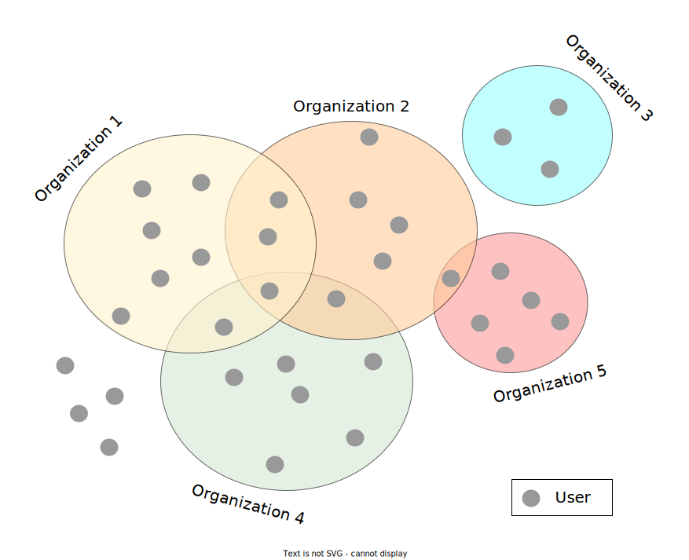

The database allow for multiple different levels of sample data "visibility" to other users. This can be achieved trough combining access control to the sample based on two criteria:
 1. access control for individual users
 2. access control for groups of users (organizations)

Access to data is granted to each sample. There is a spectrum of options for sharing the data the to extermes being: Data is available only to the users who uploaded the sample <-> Data is avalible to all users of the mbase portal.

User has access permissions for the data:

1. uploaded by user
2. uploaded by user from other organisation where I am a member
3. uploaded by user from other organisation where he is not a member but the data are shared with one of the organisations where he is a member (shared with me)

The data can be shared. User can share his own data and data of the organisations where he is administrator.
- show my private data
- show my data shared with others
- data of others shared with me or my organisations

 