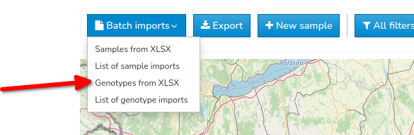
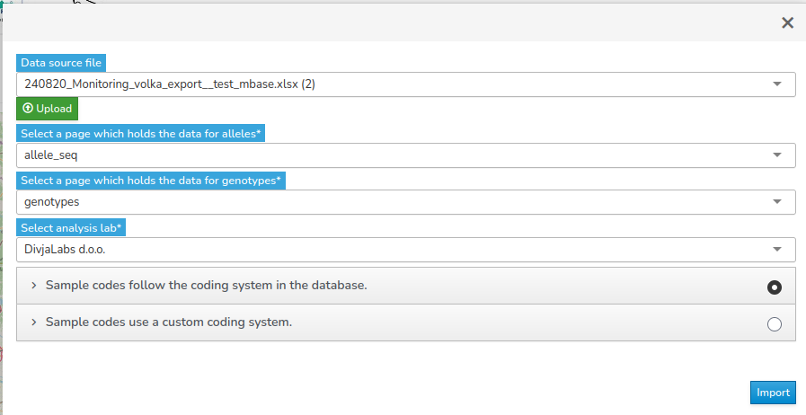
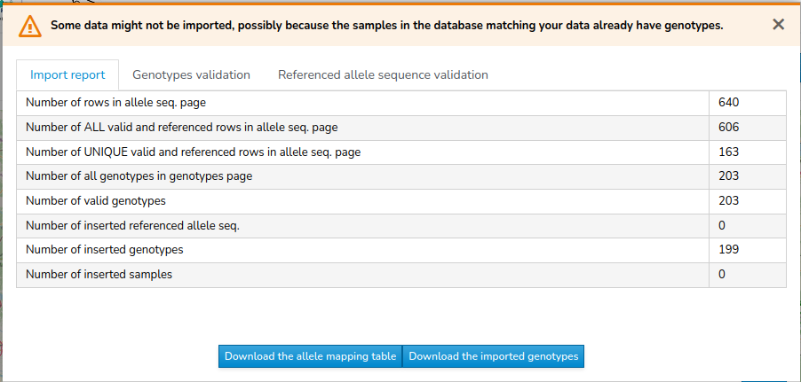
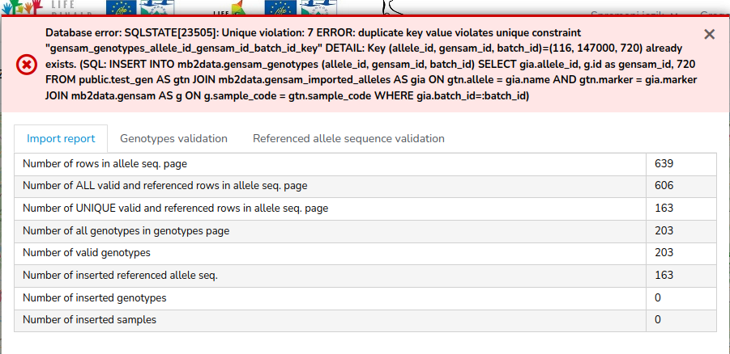

The `Genotypes Import` dialog is available in the dropdown menu of the `Batch Imports` button.

{width=439 height=144}

## Before the import

All the fields in the `Genotypes Import` dialog are required:
- data source: XLSX file, you can either upload it or select one from the previous uploads
- page in the upload XLSX file which holds the allele name references
- page in the upload XLSX file which holds the genotype data
- the laboratory which provided the data

{width=673 height=347}

Additionally, you are to choose one of the following options:
- sample codes follow the coding system in the database or
- sample codes use a custom coding system

If you choose the first option (database sample codes), then the sample code of your genotypes is matched against the existing database sample records and if the records do not already have the genotype data then this data is added to the respective samples. If the uploaded sample code is not found in the database then it is checked for conformance with the database sample naming schema and if valid a new sample with the provided genotype is generated in the database.

With the second option (custom coding system) the database creates samples with the sample codes according to its internal schema - the provided codes are stored in the 2nd lab code field.
## Genotypes data verification
The genotypes table is verified in the following order:
- check for empty and/or invalid sample code - rows with invalid sample code are rejected
- check for duplicate rows, if there is different genotype data for the same sample code then those rows are rejected
- check for existing genotypes - if any of the genotypes' sample codes already exist in the database and have its genotype attached, then those rows are rejected because currently the system support one genotype per sample only
- check for access permissions to add the genotype to the specified sample - if you are not allowed to add genotype data with the sample code of the sample already in the database, then the row is rejected

## After the import

After the import the user is provided with the import report comprising:

- statistics of the import:
   - (1) number of rows in allele seq. page
   - (2) number of ALL valid and referenced rows in allele seq. page
   - (3) number of UNIQUE valid and referenced rows in allele seq. page
   - (4) number of alleles already in the database
   - (5) number of imported referenced allele seq. (= (3) - (4))
   - (6) number of all genotypes in genotypes page
   - (7) number of genotypes with empty or invalid sample code
   - (8) number of genotypes with different genotype data for the same sample code
   - (9) number of multiplicated rows (including sample code) in the genotypes page
   - (10) number of genotypes with at least one unreferenced allele in the allele seq. reference page
   - (11) number of genotypes where on at least one marker there is only one allele pair
   - (12) number of valid genotypes (= (6) - (7) - (8) - (9) + one row for each multiplicated record in (9) - (10) - (11))
   - (13) number of samples in the database with the sample code corresponding to the imported sample code and already heaving genotype data
   - (14) number of samples in the database with the sample code corresponding to the imported sample code where the user does not have permission to add the data
   - (15) number of imported genotypes (= (12) - (13) - (14)) 
   - (16) number of corresponding samples without the genotype data found in the database where the genotype data was added with this import
   - (17) number of newly created samples (= (15) - (16))

- list of rejected genotypes samples with the reason for rejection. The reasons for rejection are:
   - empty sample code
   - sample code in a wrong format - applicable only if the user has chosen the import according to the database sample naming schema
   - empty markers - if there is no valid allele pair for any of the markers
   - denied access to the sample - if the sample is not owned by or shared with the user / user group importing the data
   - existing genotype - if the genotype for the specific sample is already present (applicable only if the user has chosen the import according to the database sample naming schema)
   - missing allele pair - if there is only one allele pair present for the specific marker
   - unreferenced allele name - if the specific allele is not referenced in the allele sequence referencing page
   - multiplicated sample row - if for the same sample code there exists two or more different genotypes

It may also happen that for the same sample code exists two or more genotypes which are the same - in this case the sample genotype is imported.
   
- referenced allele seq. validation (only the items that failed validation are shown):
   - missing value
   - repeated sequence with different allele name
   - repeated allele name with different sequence

The user is also presented with two buttons in the dialog footer:
- download of the allele mapping table
- download the imported genotypes

First option downloads XLSX file containing sheet with four columns which holds the mapping between the database given allele names and the names the user provided in the input file:
- imported name
- database name
- marker
- sequence

The 2nd option exports XLSX file with the genotypes which were uploaded in the respective batch import.

### Import status

The header of the report dialog can have one of the following three values:
- success (when the number of all the input genotype rows equals to the number of imported genotypes)
- warning (when the number of all the input genotype rows differs to the number of imported genotypes)
- error: 
   - when the database outputs error message
   - when the number of genotypes for import (after validation) found in the uploaded XLSX file is 0
   - when the number of imported genotypes is 0. This could happen due to all the corresponding samples in the database having genotype data already present or to insufficient access permissions to upload the genotypes on the corresponding samples.

