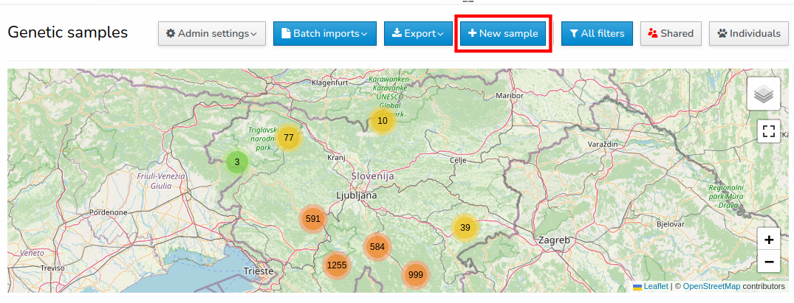
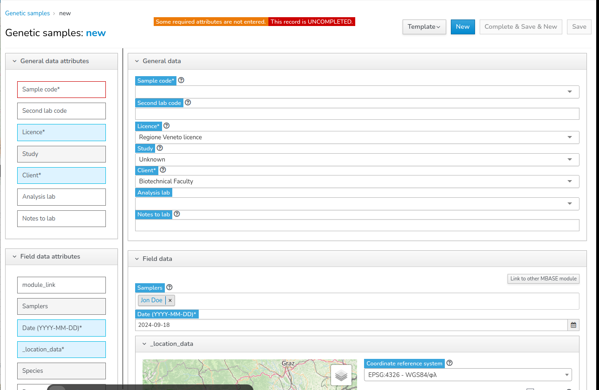
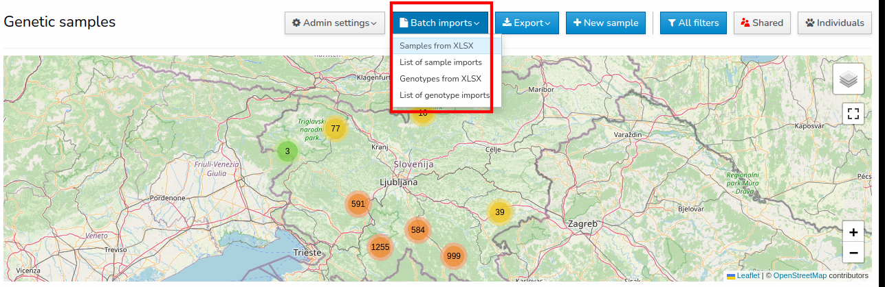
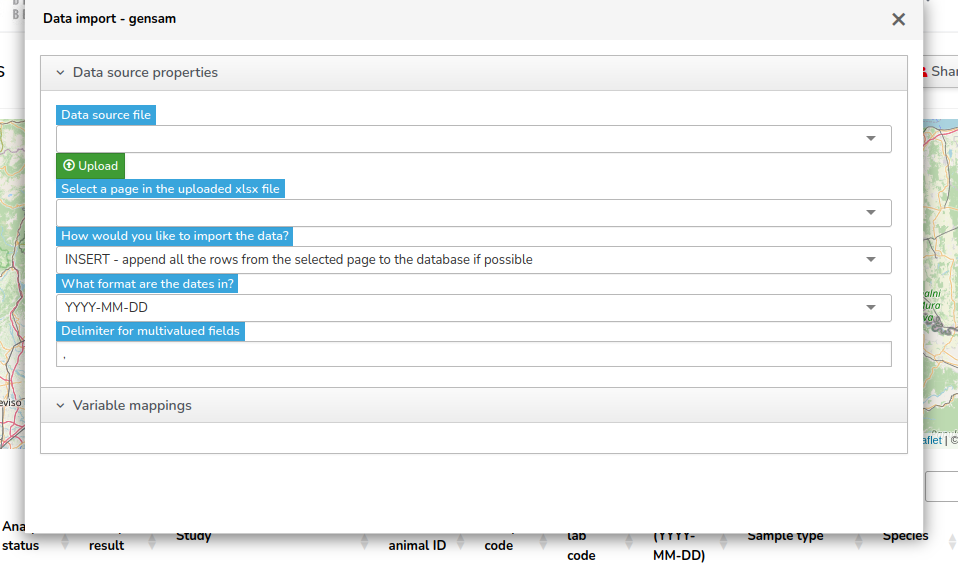
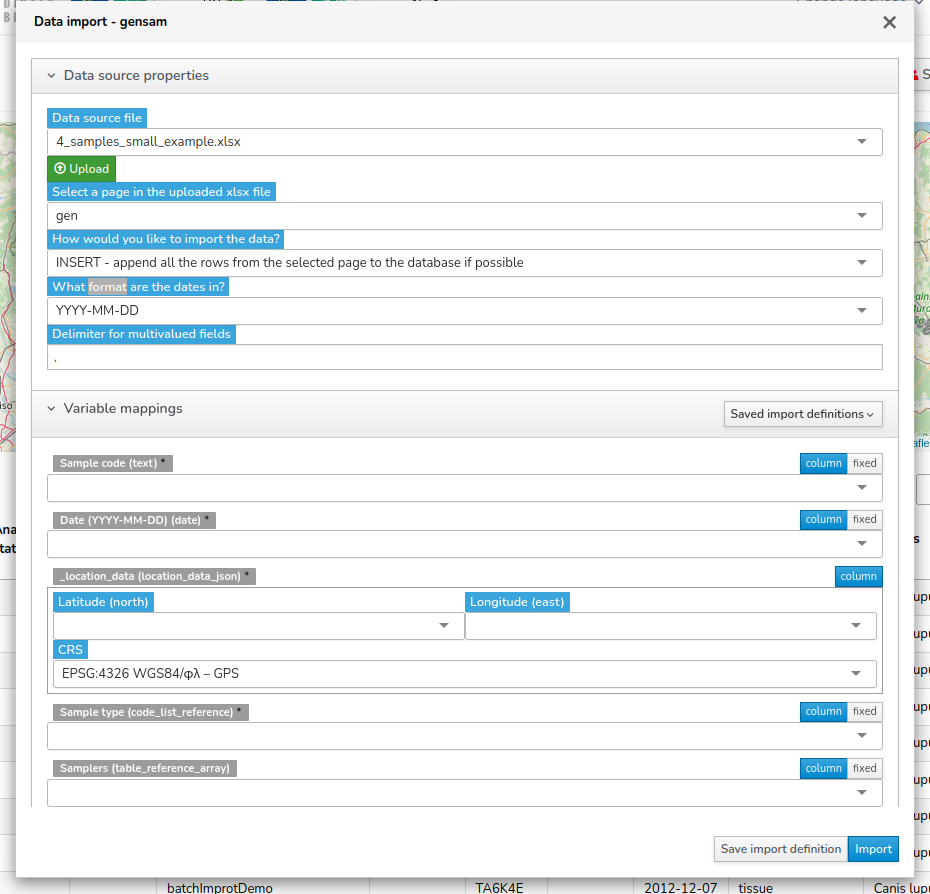
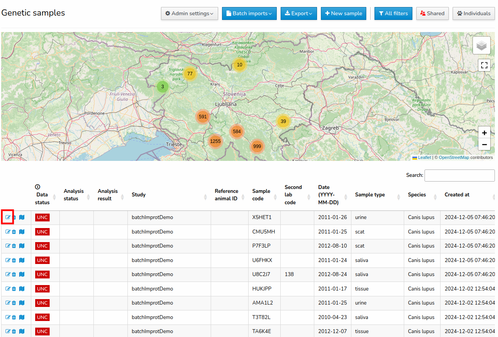
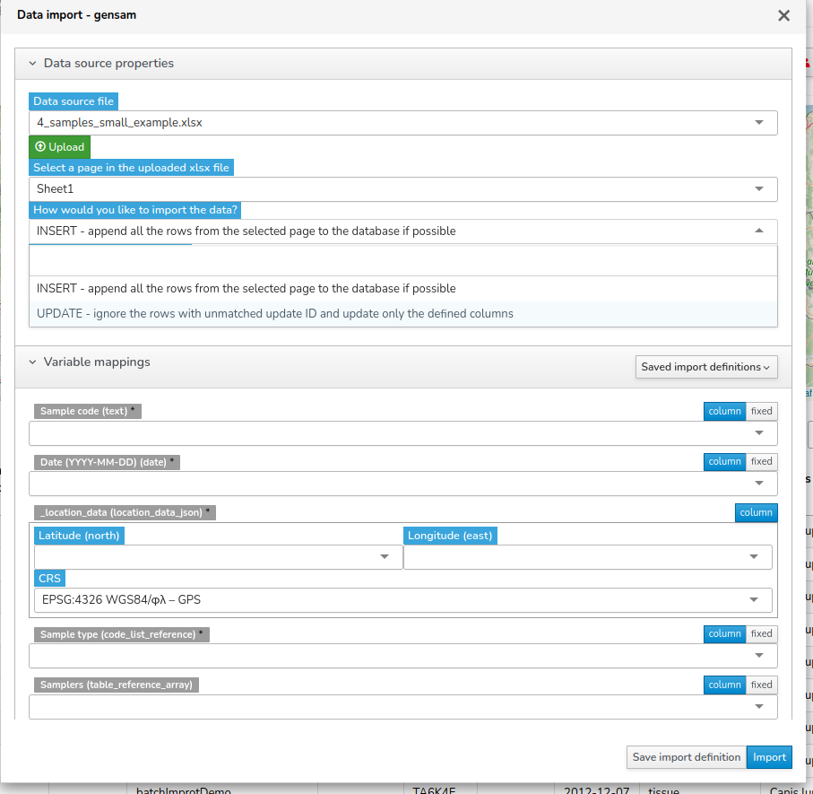

# Overview
The database organizes its core functionality around samples, which are the fundamental units for managing data. All operations, such as assigning access permissions or importing genotype data, are handled at the sample level. 

# Sample metadata
Each samples can have many predefined metadata attributes, that can be separated into 5 categories:

 1. General attributes
 2. Field attributes
 3. Location attributes
 4. Lab attributes
 5. User access attributes

## Mandatory and common metadata attributes

The database includes numerous predefined metadata attributes, which are organized hierarchically. Some attributes are dependent on the selection of others, allowing for dynamic and context-specific metadata entries, with only the most common attributes listed here.

| ID  | Database Name                    | Attribute                        | Mandatory |
|-----|----------------------------------|----------------------------------|-----------|
| 1   | `sample_code`                    | Sample code                     | *         |
| 2   | `second_lab_code`                | Second lab code                 |           |
| 3   | `_licence_name`                  | Licence                         | *         |
| 4   | `study`                          | Study                           |           |
| 5   | `organisation`                   | Client                          | *         |
| 6   | `analysing_lab`                  | Analysis lab                    |           |
| 7   | `_notes_to_lab`                  | Notes to lab                    |           |
| 8   | `samplers`                       | Samplers                        |           |
| 9   | `event_date`                     | Date (YYYY-MM-DD)               | *         |
| 10  | `crs`                            | Coordinate reference system     |           |
| 11  | `_location_data.lat`             | Latitude                        | *         |
| 12  | `_location_data.lon`             | Longitude                       | *         |
| 13  | `_location_data.additional.lname`| Local name                      |           |
| 14  | `species_list_id`                | Species                         |           |
| 15  | `_sample_collection_method`      | Sample collection method        |           |
| 16  | `_sample_type`                   | Sample type                     | *         |
| 17  | `_notes`                         | Field notes                     |           |
| 18  | `ref_animal_id`                  | Reference animal ID             |           |
| 19  | `genetic_species`                | Genetically determined species  |           |
| 20  | `gensam_populations_id`          | Population                      |           |
| 21  | `genetic_sex`                    | Genetically determined sex      |           |
| 22  | `lab_notes`                      | Lab notes                       |           |
| 23  | `user_access_ids`                | User access                     |           |
| 24  | `organisation_access_ids`        | Organisation access             |           |

[All sample metadata attributes](Sample-metadata-attributes)

# Metadata Entry Process

Two possibilites for metadata entry exist:
 1. **Sample entry form**
 2. **Batch import**

## Sample entry form

Sample entry form is integrated into the web user interface of the database. It is designed for single sample entry. In the main window of genetic samples browser select **New sample**.

This will open a new window that enables single sample entry attribute by attribute.

## Batch import

Batch import enables users to upload multiple samples with their metadata at once. To import the sample metadata this way, the user must prepare a **MS Excel** `.xlsx` file, where all the samples and their metadata are listed on one sheet. Column names and the order of columns are not important, as the Batch import functionality allows for variable mapping.

To import samples, select **Batch import** in the main window of the genetic samples browser. Then, from the dropdown menu that appears, choose **Samples from XLSX**.

 A new window will appear, allowing you to upload the `.xlsx` file containing the sample metadata.

After uploading or selecting the `.xlsx` file, the user must fill out a few Data Source properties. Once these are completed, the user can proceed to Variable mapping.

Variable mapping involves a simple procedure of selecting columns from the `.xlsx` file and matching them to the corresponding columns in the database. For most attributes, there is an option to import the variable from the corresponding **column** or select a **fixed** variable . When the **fixed** option is selected, the same variable entry will be added to all the samples listed in the `.xlsx` file.

If the **fixed** option is selected for attributes that have a code list in the database (e.g., sample type), the user must select the attribute from the dropdown menu of the code list options. If the **fixed** option is selected for attributes without code lists, the user enters a string, which will then be added to all the samples under that attribute.

There is also an option called **Save Import Definition**, where the user can save the variable mapping. This is useful if the user wants to reuse the same column-to-attribute connections for future `.xlsx` files. By saving the mapping, the user can quickly apply the same setup to other files without needing to remap the variables each time.

# Updating metadata for existing samples

Updating metadata for existing samples can be done in the same way as entering new data. 

## Sample edit form

To edit the metadata for a single existing sample, the user must first select one of the samples listed in the table at the bottom of the main window of the genetic samples browser. By clicking on the edit icon, a new window will appear with the sample entry form pre-filled with the existing data. The exist data can be changed or new data added.

## Batch Edit = Batch Import

The procedure for editing metadata of multiple samples at once is the same as uploading multiple samples. The user must prepare an `.xlsx` file in which the **Sample codes** of the samples they want to edit are listed. Apart from that, the file can also contain any other data the user wants to change or add.

Once the `.xlsx` file is prepared, the user can follow the same steps as for batch import: select **Batch import** from the main window, choose **Samples from XLSX**, and upload the file. 

> After the upload, the user must change the *How would you like to import this data* Data source property from **INSERT** to **UPDATE**  

The **UPDATE** option ignores the rows of the `.xlsx` file that have unmatched sample codes and updates the defined attributes for samples that have matching sample codes already saved in the database.

The user can then map the columns to the appropriate attributes and proceed with the changes. Keep in mind the **column**/**fixed**  mapping option that also applies here. After confirming the mappings, the selected samples will be updated with the new data from the file. 

